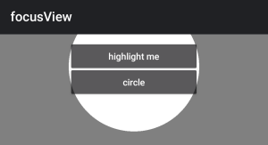
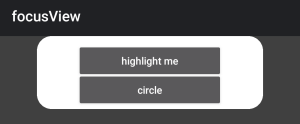

# Ti.FocusView - Create view masks to highlight elements in your app




The module will create semi-transparent views where you can set a square/circle that will be fully transparent.

## Features

-   create a (rounded) rectangle or circle
-   animate the highlight view

## Methods

-   <b>createView()</b>: creates the view with the following properties:
    -   top
    -   left
    -   width
    -   height
    -   borderRadius
    -   opacity: transparency of the outer view
    -   radius (optional, if you set a value >= 0 it will create a circle and ignores: borderRadius, width, height)

-   <b>animateBox()</b>: animates the view
    -   _all parameters above_
    -   duration: time in milliseconds

## Example

```js
import focusView from 'ti.focusView';
const view = focusView.createView({
	width: 300,
	height: 340,
	borderRadius: 10,
	opacity: 0.05
});

view.animateBox({
  top: 100,
  left: 100,
  width: 100,
  height: 100,
  opacity: 0.75,
  duration: 2000,
  borderRadius: 0
})
```

## Author

- Android: Michael Gangolf ([@MichaelGangolf](https://twitter.com/MichaelGangolf) / [Web](http://migaweb.de)) <span class="badge-buymeacoffee"><a href="https://www.buymeacoffee.com/miga" title="donate"></a></span>
